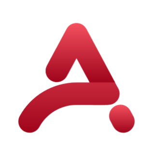

<div align="center">



# Abhinav Tripathi — Developer Portfolio

**Full-Stack Developer · React · Python · FastAPI · MERN Stack**

[](https://github.com/0609Abhinav/Portfolio)
[](https://reactjs.org)
[](https://tailwindcss.com)
[](https://fastapi.tiangolo.com)
[](LICENSE)

<br/>


</div>

---

## ✨ Overview

A **cinematic, premium, interactive** developer portfolio built from scratch — designed to feel like a product experience, not a template. Every section has depth, motion, and purpose.

> Built with React 18, Tailwind CSS, Framer Motion, GSAP, and a FastAPI backend.

---

## 🚀 Features

| Feature | Details |
|---|---|
| **3D Desktop Setup** | Fully coded VS Code + Terminal + Browser preview in the hero |
| **Particle Field** | Canvas 2D animated particles with mouse parallax |
| **GSAP Animations** | Cinematic intro timeline + ScrollTrigger section reveals |
| **Framer Motion** | Smooth page transitions, stagger reveals, AnimatePresence |
| **3D Tilt Cards** | Mouse-tracking rotateX/Y on project cards with light reflection |
| **Magnetic Buttons** | Cursor pull effect on all CTAs and nav links |
| **Cursor Spotlight** | Soft radial glow that follows the cursor |
| **Floating Dev Icons** | 20 tech icons (React, Python, Docker, AWS…) floating in every section |
| **3D Laptop Man** | PNG illustration with real-time mouse-tracking 3D tilt |
| **Typing Effect** | Custom hook cycling through developer roles |
| **Code Splitting** | `React.lazy` + `Suspense` on all below-fold sections |
| **FastAPI Backend** | REST API for projects, skills, experience, contact |
| **Local Fallback** | Works fully without backend — data served from local files |

---

## 🎨 Design System

```
Background:   #020510  →  #050816  (deep space dark)
Accent Blue:  #3B82F6  (primary actions)
Accent Purple:#8B5CF6  (gradients, glows)
Accent Pink:  #f472b6  (highlights)
Accent Cyan:  #06B6D4  (cloud, info)
Text Primary: #f1f5f9
Text Muted:   #64748b
Font:         Inter (300–900)
```

---

## 🗂️ Project Structure

```
portfolio/
├── public/
│   ├── logo.png              # A logo (favicon + navbar)
│   ├── resume.pdf            # Downloadable CV
│   └── index.html
│
├── src/
│   ├── assets/               # Images, illustrations
│   ├── components/
│   │   ├── layout/
│   │   │   ├── Navbar.jsx    # Sticky nav, logo, mobile menu
│   │   │   └── Footer.jsx
│   │   ├── sections/
│   │   │   ├── Hero.jsx      # 3D desktop + particles + GSAP
│   │   │   ├── About.jsx     # Timeline education + stats
│   │   │   ├── Skills.jsx    # Tabbed skill cards
│   │   │   ├── Projects.jsx  # 3D tilt cards + modal
│   │   │   ├── AITools.jsx   # Interactive AI tool cards
│   │   │   └── Contact.jsx   # Functional contact form
│   │   └── ui/
│   │       ├── DesktopSetup.jsx   # 3D coded monitor scene
│   │       ├── ParticleField.jsx  # Canvas 2D particles
│   │       ├── FloatingIcons.jsx  # Dev icons + 3D laptop man
│   │       ├── CursorSpotlight.jsx
│   │       ├── MagneticButton.jsx
│   │       ├── SectionHeader.jsx
│   │       └── Skeleton.jsx
│   ├── data/
│   │   ├── projects.js       # All project data
│   │   ├── skills.js         # Skill categories + levels
│   │   └── experience.js     # Education, certs, personal info
│   ├── hooks/
│   │   ├── useFetch.js       # Generic data fetching
│   │   ├── useScrollReveal.js
│   │   ├── useTyping.js      # Typing effect
│   │   ├── useTilt.js        # 3D mouse tilt
│   │   └── useMagnet.js      # Magnetic cursor pull
│   ├── services/
│   │   └── api.js            # API layer (backend or local fallback)
│   └── styles/
│       └── globals.css       # Tailwind + design system
│
└── backend/
    ├── main.py               # FastAPI app
    ├── database.py           # SQLAlchemy + SQLite/PostgreSQL
    ├── models.py             # Pydantic models
    ├── routers/
    │   ├── projects.py
    │   ├── skills.py
    │   ├── experience.py
    │   └── contact.py
    └── requirements.txt
```

---

## ⚡ Getting Started

### Frontend

```bash
# Clone
git clone https://github.com/0609Abhinav/Portfolio.git
cd Portfolio

# Install
npm install

# Run dev server
npm start
# → http://localhost:3000
```

### Backend (optional)

```bash
cd backend

# Install Python deps (Python 3.7+)
pip install -r requirements.txt

# Run
python -m uvicorn main:app --reload --port 8000
# → http://127.0.0.1:8000
# → Swagger UI: http://127.0.0.1:8000/docs
```

### Connect Frontend to Backend

Create a `.env` file in the project root:

```env
REACT_APP_API_URL=http://127.0.0.1:8000
REACT_APP_CONTACT_EMAIL=your@email.com
```

> Without `.env`, the frontend uses local data files automatically — no backend needed.

---

## 🔌 API Endpoints

| Method | Endpoint | Description |
|--------|----------|-------------|
| `GET` | `/projects` | All projects (filter by `?category=Web`) |
| `GET` | `/skills` | Skill categories with levels |
| `GET` | `/experience` | Education + certifications |
| `POST` | `/contact` | Submit contact message |
| `GET` | `/health` | Health check |

---

## 🛠️ Tech Stack

**Frontend**
- React 18 + React Router
- Tailwind CSS 3
- Framer Motion 12
- GSAP + ScrollTrigger
- react-scroll

**Backend**
- FastAPI
- SQLAlchemy + SQLite / PostgreSQL
- Pydantic v1
- Uvicorn

**Dev Tools**
- Create React App
- PostCSS + Autoprefixer

---

## 📦 Build

```bash
npm run build
# Output → /build (production-optimized)
```

---

## 🤝 Connect

<div align="center">

[](https://github.com/0609Abhinav)
[](https://www.linkedin.com/in/abhinav-tripathi-770224253/)

</div>

---

<div align="center">
  <sub>Designed & built by <strong>Abhinav Tripathi</strong> · 2025</sub>
</div>
